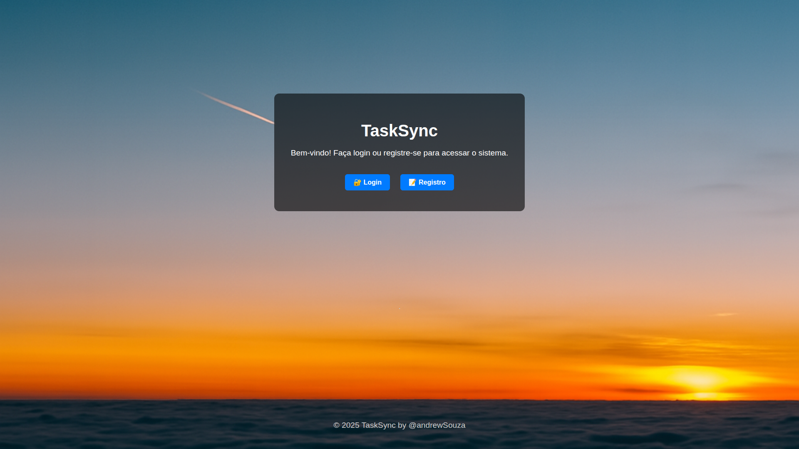
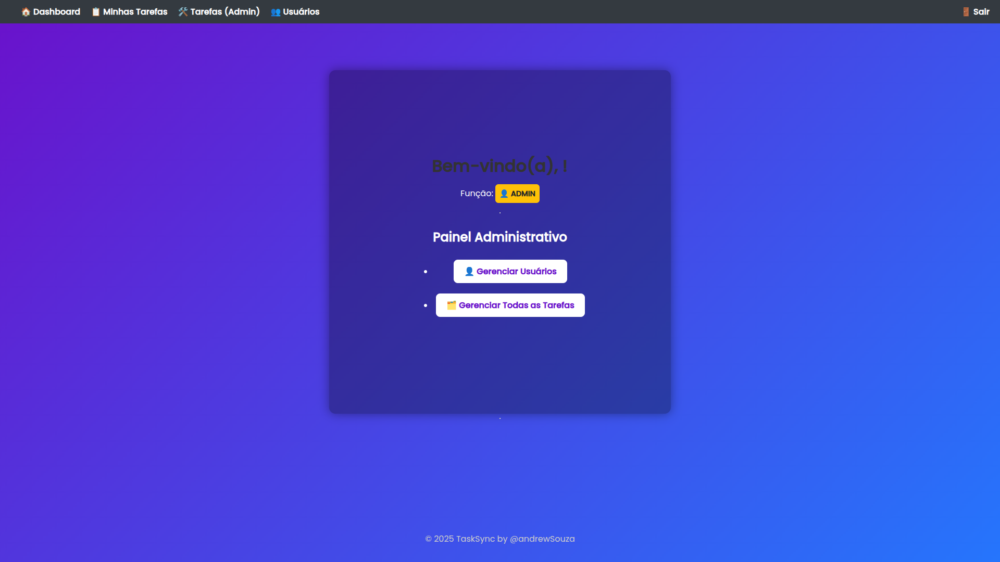
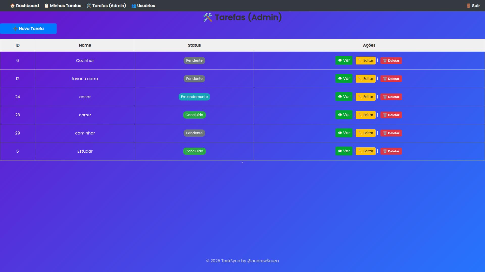

# 📌 TaskSync — Sistema de Gerenciamento de Tarefas

**TaskSync** é uma aplicação web **fullstack** desenvolvida para ajudar na **organização de tarefas do cotidiano** com eficiência e clareza.  
O sistema permite que usuários **criem, editem, acompanhem e gerenciem tarefas em tempo real**, com **autenticação segura** e **interface intuitiva**.

---

## 🚀 Funcionalidades

- ✅ **Cadastro e login** de usuários com autenticação via **JWT**
- 🧑‍💼 **Perfis diferenciados**: `ADMIN` e `MEMBER`
- 📋 **Criação, edição e exclusão** de tarefas
- 📊 **Status de tarefas**: `PENDING`, `RUNNING`, `COMPLETED`, `FAILED`
- 🔐 **Proteção de rotas** com middleware de autenticação
- 🎨 **Interface responsiva** com **EJS** e **CSS** customizado
- 🧠 **Arquitetura MVC** para melhor organização do projeto

---

## 🛠️ Tecnologias Utilizadas

| Camada          | Tecnologias                              |
|-----------------|-------------------------------------------|
| **Backend**     | Node.js, Express, JWT, Prisma             |
| **Frontend**    | EJS, CSS                                 |
| **Banco de Dados** | PostgreSQL                            |
| **Autenticação** | JWT + Cookies                            |
| **Estilo**      | CSS customizado + classes utilitárias     |

---

## ⚙️ Instalação e Execução

```bash
# Clonar o repositório
 git clone https://github.com/andrewSouza-dev/taskSync.git

 # Entrar na pasta do projeto
cd taskSync

# Instalar as dependências
npm install

# Executar o servidor em modo desenvolvimento
npm run dev
Servidor disponível em: http://localhost:3000

```

---

🧪 Como Testar o Sistema:

📝 Registrar um novo usuário

🔑 Fazer login

🧱 Criar uma nova tarefa

🔄 Alterar o status da tarefa (PENDING → RUNNING → COMPLETED)

📊 Visualizar todas as tarefas no dashboard

---

## 📸 Screenshots

[](http://)



## 🧠 Autor

Desenvolvido por @andrewSouza
💡 Apaixonado por tecnologia, produtividade e código limpo.

## 📄 Licença

Este projeto está sob a licença MIT.
